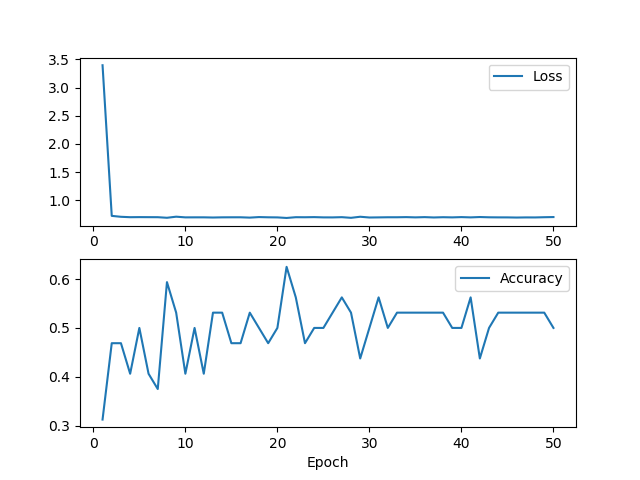
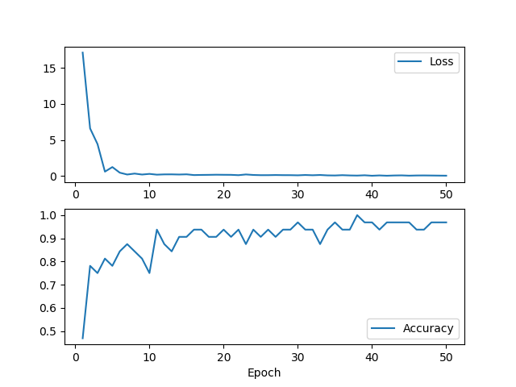
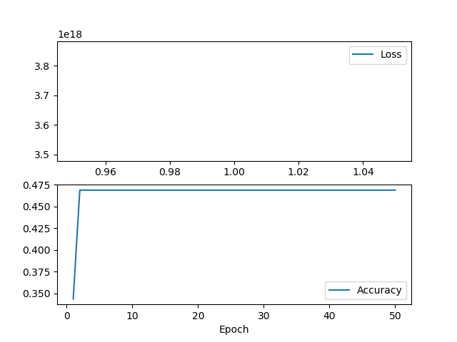
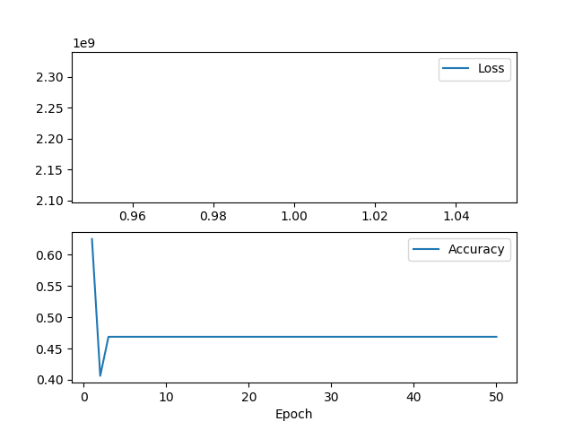
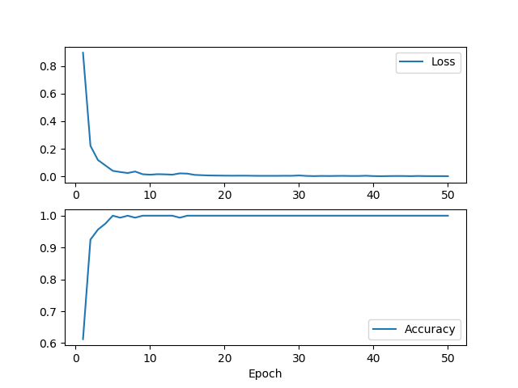
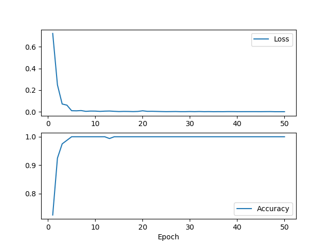
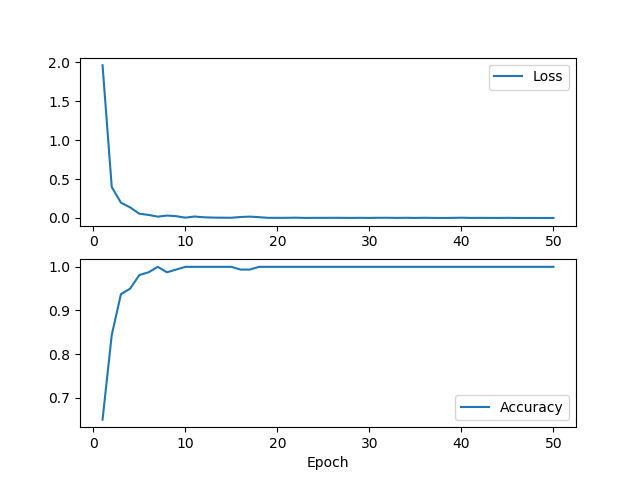
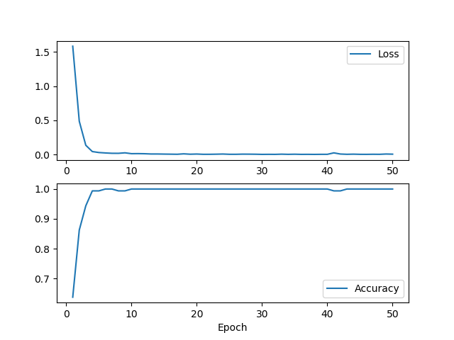

# ECE 516 Homework 4 - Video Activity Recognition

## Training and Model Parameters - Talking/No-Talking (tnt)

### Inverse Pyramid
```
============== BEST OF ALL =============
{'input_size': (300, 100, 100, 1), 'num_conv_nets': 2, 'num_first_filters': 2}
Best of all loss: 1.8521698713302612
Best of all metric: 0.5714285969734192
========================================

Accuracy on test set: 0.375
[[3 0]
 [5 0]]

Accuracy on train set: 0.48
[[12  0]
 [13  0]]

Total params: 21,823,855
```


### Pyramid
```
============== BEST OF ALL =============
{'input_size': (300, 100, 100, 1), 'num_conv_nets': 2, 'num_first_filters': 8}
Best of all loss: 0.31187453866004944
Best of all metric: 0.8571428656578064
========================================

Accuracy on test set: 0.875
[[3 0]
 [1 4]]

Accuracy on train set: 1.0
[[14  0]
 [ 0 11]]
 
Total params: 21,824,125
```


### Single
```
============== BEST OF ALL =============
{'input_size': (300, 100, 100, 1), 'num_conv_nets': 1, 'num_first_filters': 2}
Best of all loss: nan
Best of all metric: 0.0
========================================

Accuracy on test set: 0.625
[[0 3]
 [0 5]]

Accuracy on train set: 0.6
[[ 1 10]
 [ 0 14]]

Total params: 91,584,027
```


### Single/Optical Flow
```
============== BEST OF ALL =============
{'input_size': (299, 100, 100, 2), 'num_conv_nets': 1, 'num_first_filters': 2}
Best of all loss: 0.7457094192504883
Best of all metric: 0.2857142984867096
========================================

Accuracy on test set: 0.625
[[0 3]
 [0 5]]

Accuracy on train set: 0.44
[[ 1 14]
 [ 0 10]]

Total params: 91,584,043
```


## Training and Model Parameters - Writing/No-Writing (wnw)

### Inverse Pyramid
```
============== BEST OF ALL =============
{'input_size': (90, 50, 50, 1), 'num_conv_nets': 3, 'num_first_filters': 4}
Best of all loss: 0.13542520999908447
Best of all metric: 0.96875
========================================

Accuracy on test set: 0.9375
[[37  0]
 [ 5 38]]

Accuracy on train set: 1.0
[[65  0]
 [ 0 63]]
 
 Trainable params: 513,653
```


### Pyramid
```
============== BEST OF ALL =============
{'input_size': (90, 50, 50, 1), 'num_conv_nets': 2, 'num_first_filters': 8}
Best of all loss: 0.20059503614902496
Best of all metric: 0.9375
========================================

Accuracy on test set: 0.9375
[[37  0]
 [ 5 38]]

Accuracy on train set: 1.0
[[65  0]
 [ 0 63]]

Total params: 1,301,629
```


### Single
```
============== BEST OF ALL =============
{'input_size': (90, 50, 50, 1), 'num_conv_nets': 1, 'num_first_filters': 4}
Best of all loss: 1.0161904096603394
Best of all metric: 0.875
========================================

Accuracy on test set: 0.925
[[36  1]
 [ 5 38]]

Accuracy on train set: 1.0
[[67  0]
 [ 0 61]]

Total params: 12,976,437
```


### Single (Optical Flow)
```
============== BEST OF ALL =============
{'input_size': (89, 50, 50, 2), 'num_conv_nets': 1, 'num_first_filters': 2}
Best of all loss: 2.3263602256774902
Best of all metric: 0.78125
========================================

Accuracy on test set: 0.8125
[[33  4]
 [11 32]]

Accuracy on train set: 1.0
[[63  0]
 [ 0 65]]
 
Total params: 6,488,363
```



# Conclusion
