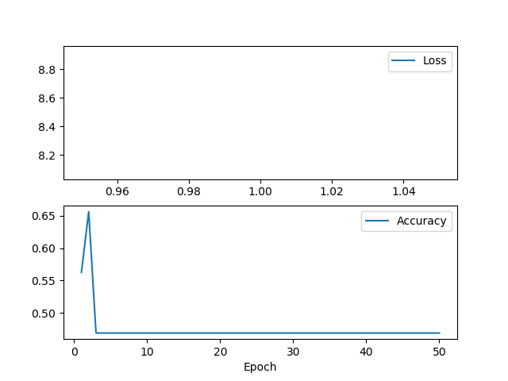
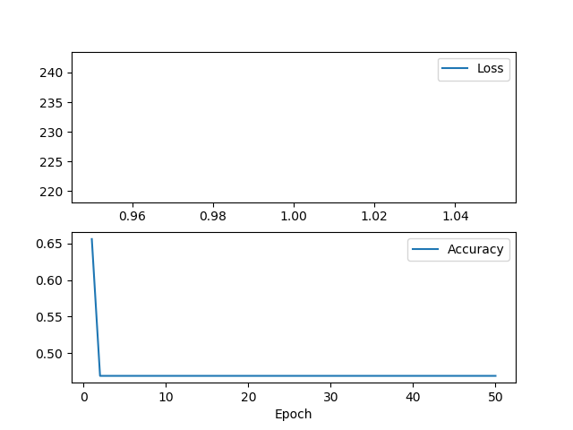

# ECE 516 Homework 4 - Video Activity Recognition

The convolutional layers used were nearly identical to the example code initially provided except
I added a BatchNormalization at the end so each convolutional unit was comprised of a 
Conv3D, MaxPooling, and BatchNormalization. All models used the default convolution kernel size of 2x2x2. 

## Training and Model Parameters - Talking/No-Talking (tnt)

The size of the provided tnt videos were 100x100 so it was much harder with the available hardware
available (even on Xena) get good results as often time there were memory issues. I had trouble getting good
results for most of the tnt models.

### Inverse Pyramid
```
============== BEST OF ALL =============
{'input_size': (300, 100, 100, 1), 'num_conv_nets': 2, 'num_first_filters': 2}
Best of all loss: 1.8521698713302612
Best of all metric: 0.5714285969734192
========================================

Accuracy on test set: 0.375
[[3 0]
 [5 0]]

Accuracy on train set: 0.48
[[12  0]
 [13  0]]

Total params: 21,823,855
```


Nearly 22 million parameters but useless...

### Pyramid
```
============== BEST OF ALL =============
{'input_size': (300, 100, 100, 1), 'num_conv_nets': 2, 'num_first_filters': 8}
Best of all loss: 0.31187453866004944
Best of all metric: 0.8571428656578064
========================================

Accuracy on test set: 0.875
[[3 0]
 [1 4]]

Accuracy on train set: 1.0
[[14  0]
 [ 0 11]]
 
Total params: 21,824,125
```

Pretty good results with the Pyramid! 87.5% accurate on the test set.

### Single
```
============== BEST OF ALL =============
{'input_size': (300, 100, 100, 1), 'num_conv_nets': 1, 'num_first_filters': 2}
Best of all loss: nan
Best of all metric: 0.0
========================================

Accuracy on test set: 0.625
[[0 3]
 [0 5]]

Accuracy on train set: 0.6
[[ 1 10]
 [ 0 14]]

Total params: 91,584,027
```


Nearly 92 million parameters(!!) but garbage.

The output from the convolutional layer is 149x49x49x2 which is flattened and then fed into a dense layer
with 128 elements. This alone requires 128\*(149\*49\*49\*2+1)=91,583,872 parameters!

The number of parameters is high because each of the convolutional units has a MaxPooling layer which
reduces the input size but because we only use a single layer so there are roughly 4x as many parameters as the
above two pyramid networks which contain 2 convolution units.

### Single/Optical Flow
```
============== BEST OF ALL =============
{'input_size': (299, 100, 100, 2), 'num_conv_nets': 1, 'num_first_filters': 2}
Best of all loss: 0.7457094192504883
Best of all metric: 0.2857142984867096
========================================

Accuracy on test set: 0.625
[[0 3]
 [0 5]]

Accuracy on train set: 0.44
[[ 1 14]
 [ 0 10]]

Total params: 91,584,043
```


Same as above. Nearly 92 million parameters(!!) but garbage.

## Training and Model Parameters - Writing/No-Writing (wnw)

All models used the default convolution kernel size of 2x2x2. All models produced result greater than 92.5%
on the test set except for the model which used optical flow which only achieved an accuracy of 81.25%.

### Inverse Pyramid
```
============== BEST OF ALL =============
{'input_size': (90, 50, 50, 1), 'num_conv_nets': 3, 'num_first_filters': 4}
Best of all loss: 0.13542520999908447
Best of all metric: 0.96875
========================================

Accuracy on test set: 0.9375
[[37  0]
 [ 5 38]]

Accuracy on train set: 1.0
[[65  0]
 [ 0 63]]
 
 Trainable params: 513,653
```


Great results with just over 500,000 parameters!

### Pyramid
```
============== BEST OF ALL =============
{'input_size': (90, 50, 50, 1), 'num_conv_nets': 2, 'num_first_filters': 8}
Best of all loss: 0.20059503614902496
Best of all metric: 0.9375
========================================

Accuracy on test set: 0.9375
[[37  0]
 [ 5 38]]

Accuracy on train set: 1.0
[[65  0]
 [ 0 63]]

Total params: 1,301,629
```


Another really good result with only 1.3 million parameters.

### Single
```
============== BEST OF ALL =============
{'input_size': (90, 50, 50, 1), 'num_conv_nets': 1, 'num_first_filters': 4}
Best of all loss: 1.0161904096603394
Best of all metric: 0.875
========================================

Accuracy on test set: 0.925
[[36  1]
 [ 5 38]]

Accuracy on train set: 1.0
[[67  0]
 [ 0 61]]

Total params: 12,976,437
```


Good result but nearly 13 million parameters, 10x as the previous model!

### Single (Optical Flow)
```
============== BEST OF ALL =============
{'input_size': (89, 50, 50, 2), 'num_conv_nets': 1, 'num_first_filters': 2}
Best of all loss: 2.3263602256774902
Best of all metric: 0.78125
========================================

Accuracy on test set: 0.8125
[[33  4]
 [11 32]]

Accuracy on train set: 1.0
[[63  0]
 [ 0 65]]
 
Total params: 6,488,363
```


About 6.5 million parameters. Fewer parameters than the previous result but the results aren't as good! The
only difference between the above two models is one takes the optical flow data for input. I think this pretty clearly
shows that using optical flow reduces accuracy.

# Conclusion

It was difficult to get good results on the tnt data set. Almost all models produced an unstable model that produced a "nan" result.

The wnw dataset produced consistent results for me (maybe the additional BatchNormalization layer helped?) as I was always able to get a stable result.

Given more memory and GPU power, I think it would be interesting to try different 3D kernel sizes (3x3x3, 4x4x4, or even something like 2x2x3) along with more convolutional layers/units. To reduce the number of parameters (especially for the tnt dataset) it would also be interesting to introduce a stride size of 2 or 3.

The summary for all models can be seen in [models.txt](models.txt).
